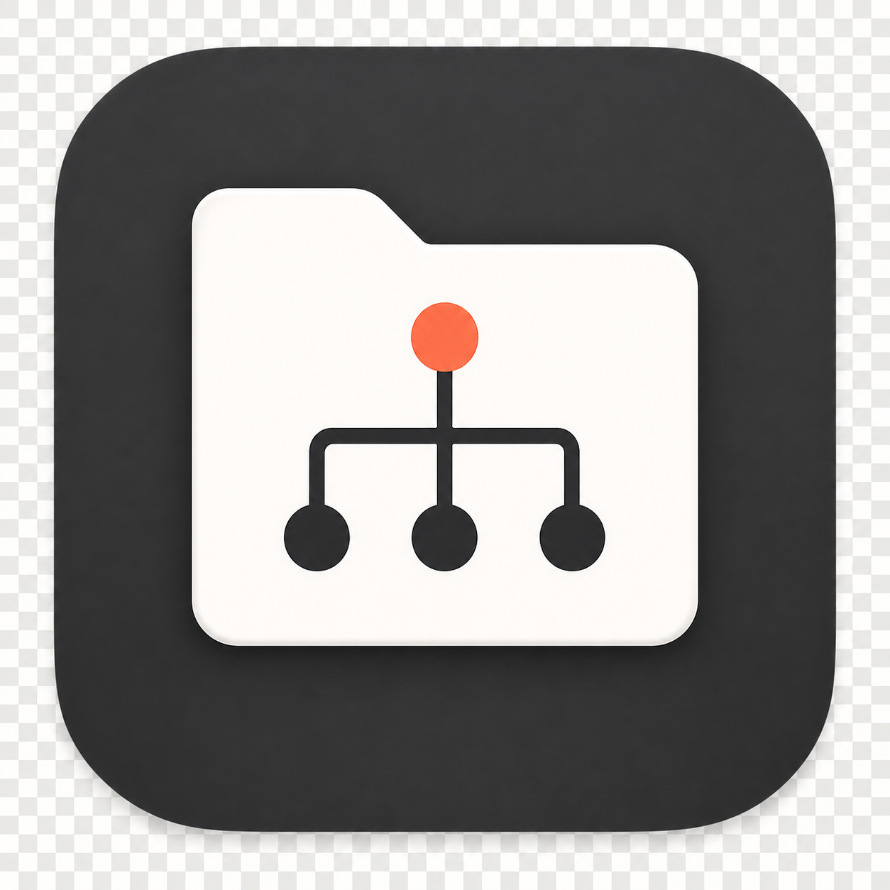
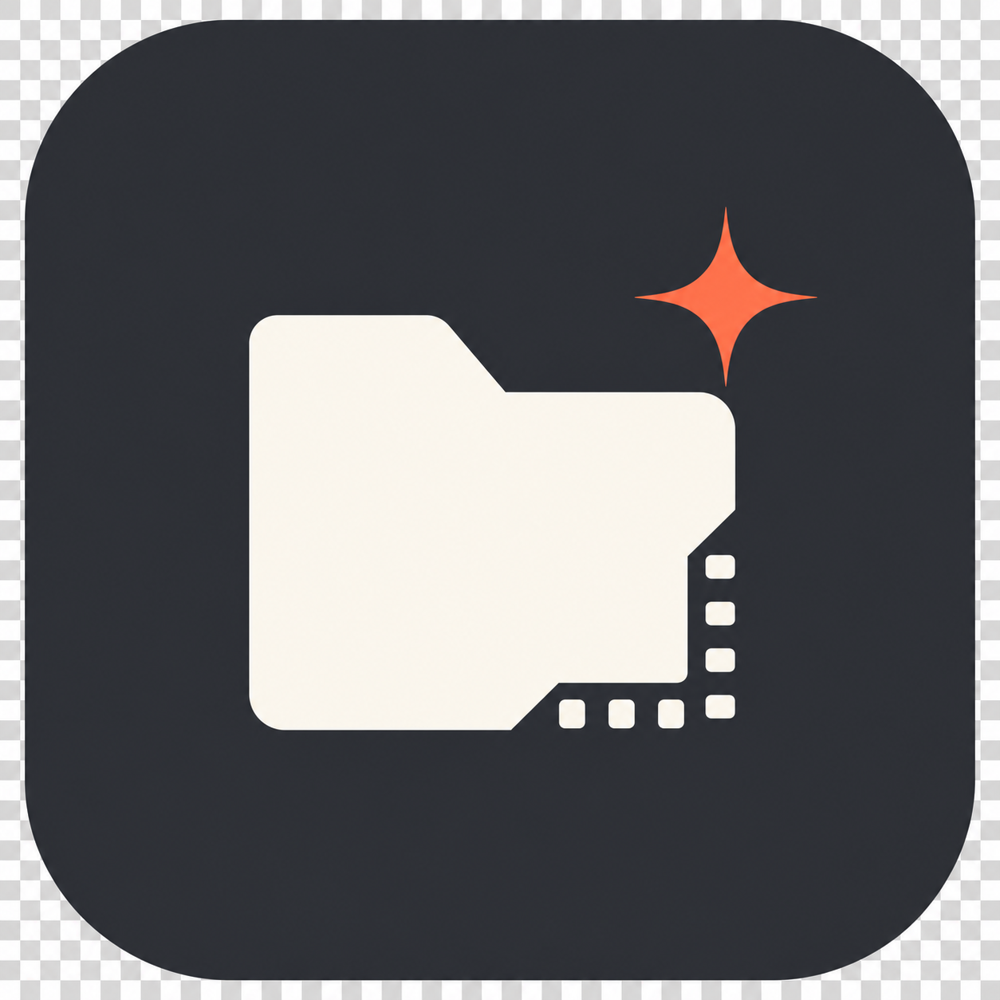

# 应用图标候选

生成时间：2026-07-14

## 选定结果

用户已选定 **A：文件夹 + 目录树** 作为正式图标方向。后续只围绕 A 清理真实透明通道、优化小尺寸轮廓并导出各平台资源；B、C、D 保留为过程参考，不再继续深化。

正式主图已完成真实透明蒙版清理，Tauri 已生成标准 PNG、ICO 与 ICNS 资源，并嵌入“视频管理助手”Windows EXE。主图位于 `assets/app-icon-master.png`，平台资源位于 `src-tauri/icons/`。

以下图标是概念候选，用于确定视觉方向。选定后需要重新清理轮廓与真实透明通道，并输出桌面应用所需的完整尺寸。

## A：文件夹 + 目录树

正式方向。功能语义最直接；小尺寸仍能看出“目录层级”，后续需要适当压低立体感并强化 16–32 px 下的主轮廓。

## B：视频素材 + 自动生成

文件夹、胶片边角和生成闪光组合，视频行业属性最强。

## C：项目容器 + 层级节点

轮廓最简洁，功能语义明确，缩小后辨识度较好。

## D：嵌套目录 + 品牌符号

品牌感更强，但中心负形可能被误解为下载、星标或收藏。

## 选定后的正式产物

- 真实透明背景的 1024×1024 PNG 主图。
- Windows 多尺寸 `.ico`。
- macOS `.icns` 和 AppIcon 资源。
- 16、24、32、48、64、128、256、512、1024 px 的像素级检查。
- Windows 桌面/开始菜单、macOS Finder/Dock 的小尺寸预览检查。
