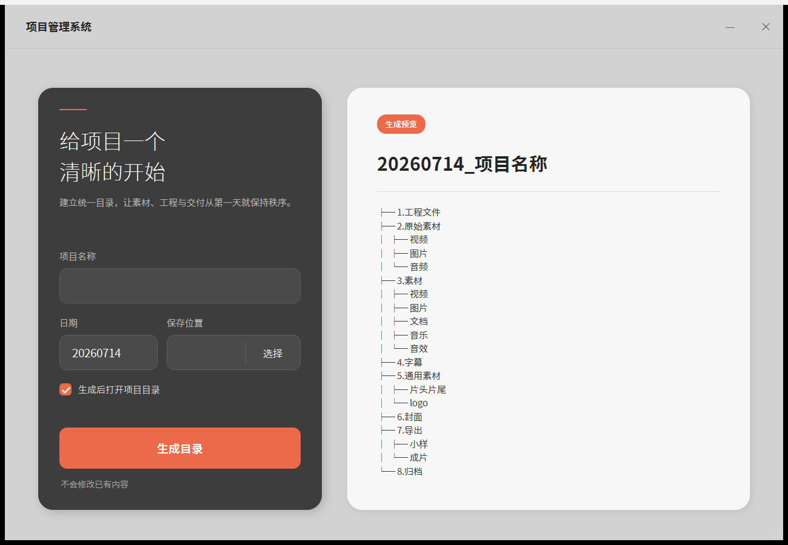

# 视频管理助手

替代已下架 Gate 软件中团队实际使用的“标准目录一键生成”能力。正式版使用 Tauri 2 构建为 Windows 便携 EXE：无需安装，双击即可运行。



## 下载与使用

正式下载：[GitHub 最新版本](https://github.com/marvellam/video-management-assistant/releases/latest)

1. 把 EXE 下载或复制到本机，也可以直接放到桌面。
2. 双击打开。
3. 填写项目名称与日期，选择保存位置。
4. 保持“生成后打开项目目录”勾选，点击“生成目录”。

根目录格式为 `日期_项目名称`，例如 `20260714_常彧老师播客`。

如果项目目录已经存在，工具只补建缺失目录，不覆盖、移动或删除任何已有内容。

## 当前目录模板

```text
日期_项目名称
├─ 1.工程文件
├─ 2.原始素材
│  ├─ 视频
│  ├─ 图片
│  └─ 音频
├─ 3.素材
│  ├─ 视频
│  ├─ 图片
│  ├─ 文档
│  ├─ 音乐
│  └─ 音效
├─ 4.字幕
├─ 5.通用素材
│  ├─ 片头片尾
│  └─ logo
├─ 6.封面
├─ 7.导出
│  ├─ 小样
│  └─ 成片
└─ 8.归档
```

以下内容是人工文件命名规则，不会创建为文件夹：

- 原始视频：`时间_机型_机位`
- 小样：`时间_片名_导出人_版本数`
- 成片：`时间_片名_分辨率_格式_备注_导出人_版本数`

## 技术结构

- `src/`：TypeScript 界面与窗口交互。
- `src-tauri/`：Rust 文件系统核心与 Tauri 配置。
- `template.json`：目录结构唯一真源，编译时嵌入 EXE。
- `Generate-VideoProject.ps1`：已验证的旧 Windows 原型，暂时保留作行为对照。
- `Build-Release.ps1`：本机构建、检查与正式产物归档。
- `.github/workflows/release.yml`：GitHub 标签触发后自动发布单个 Windows EXE。

界面与核心逻辑不依赖 Windows 专属 API；后续如需要 macOS，可在 macOS runner 上构建 `.app`，无需重写业务逻辑。

## 本机构建

本机需要 Node.js、Rust stable 与 Visual Studio 2022 C++ Build Tools。

```powershell
powershell.exe -NoProfile -ExecutionPolicy Bypass -File .\Build-Release.ps1
```

默认使用2个 Rust 编译任务，兼顾速度与当前机器的内存压力。首次构建需要编译 Tauri 依赖，之后会复用 Cargo 缓存。

只重建、不重复完整检查：

```powershell
powershell.exe -NoProfile -ExecutionPolicy Bypass -File .\Build-Release.ps1 -SkipChecks
```

## GitHub 发布

推送 `v*` 标签后，GitHub Actions 会：

1. 执行 TypeScript、Rust test、fmt 与 clippy 检查。
2. 使用 `tauri build --no-bundle` 构建原始 EXE。
3. 发布 `Video-Management-Assistant.exe` 与 `SHA256SUMS.txt`。

## 让 Agent 安装到桌面

便携 EXE 不会自行创建快捷方式，但 Agent 可以下载 GitHub Release 中的 `Video-Management-Assistant.exe`，校验后以 `视频管理助手.exe` 保存到当前用户桌面。桌面上的 EXE 本身就是可双击图标，不需要额外 `.lnk` 快捷方式。

把下面这句话直接发给能操作电脑的 Agent 即可：

```text
请从 GitHub 仓库 marvellam/video-management-assistant 的最新 Release 下载“Video-Management-Assistant.exe”和 SHA256SUMS.txt，校验哈希后以“视频管理助手.exe”保存到当前用户桌面；不要自动运行。
```

详细步骤见 `AGENT_INSTALL.md`。

当前 EXE 未做代码签名，其他电脑首次下载时可能出现 Windows SmartScreen 提示；这与参考项目 `codex-switch` 当前的发布方式一致。

本项目采用 [MIT License](LICENSE)。
